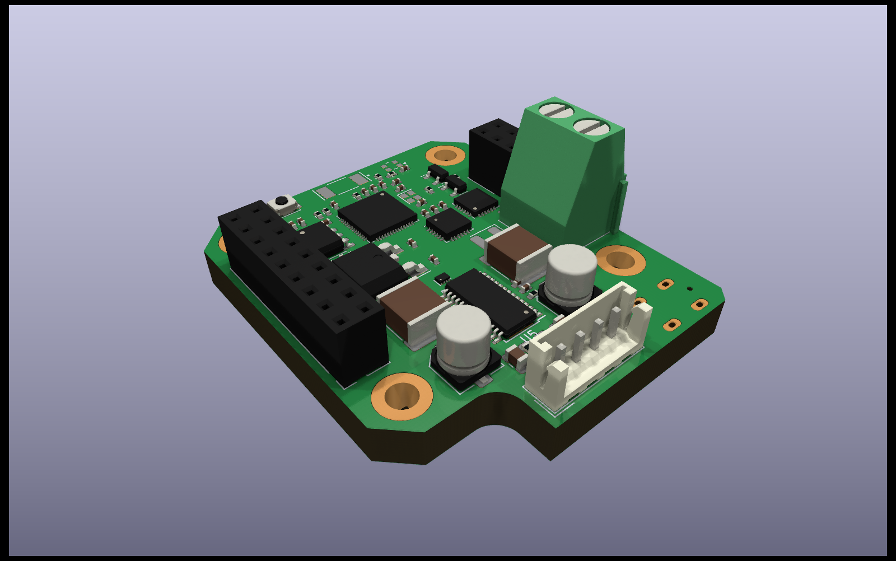

# ESP Stepper Servo

Compact WiFi and Bluetooth (5.0) NEMA-17 stepper controller featuring stall detection and silent operation. Supply 5-20V upto 5A using USB-C Power Delivery or through header connector. Easily embeddable and extendable with backpack boards for specialized operations.

<picture>
  <source media="(prefers-color-scheme: dark)" srcset="./exports/renders/driver-board-3D_front.png">
  <source media="(prefers-color-scheme: light)" srcset="./exports/renders/driver-board-3D_front.png">
  
</picture>


## Contribution

Clone repository and fetch submodules
```bash
$ git clone --recurse-submodules git@github.com:slimcdk/esp-stepper-servo.git
```

### Versioning

Revisions are controlled through git tags such any production easily can be traced back to a commit containing everything. Complete sets of compatible schematics, firmwares, 3D models, documentation will all stay together under same tag in the source history. Firmware updates to older board revisions will however get out of sync at some point.


## Drawings
<picture>
  <source media="(prefers-color-scheme: dark)" srcset="./exports/schematic/driver-board-schematic.svg">
  <source media="(prefers-color-scheme: light)" srcset="./exports/schematic/driver-board-schematic.svg">
  
</picture>
<a href="exports/schematic/driver-board-schematic.pdf">Open schematic PDF</a>


---
## Software uses
* https://www.kicad.org/
* https://www.freecadweb.org/
* https://github.com/features/actions
  * https://github.com/INTI-CMNB/KiBot
* https://code.visualstudio.com/
  * https://marketplace.visualstudio.com/items?itemName=ms-vscode-remote.remote-containers